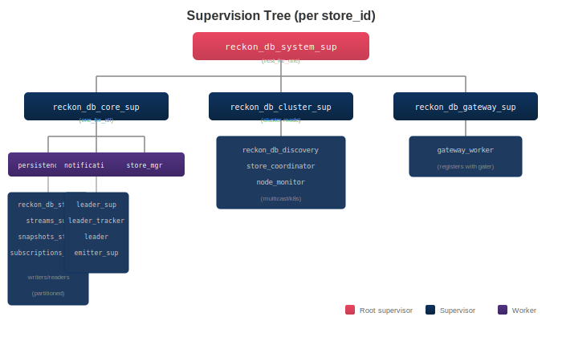
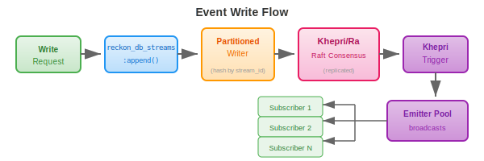
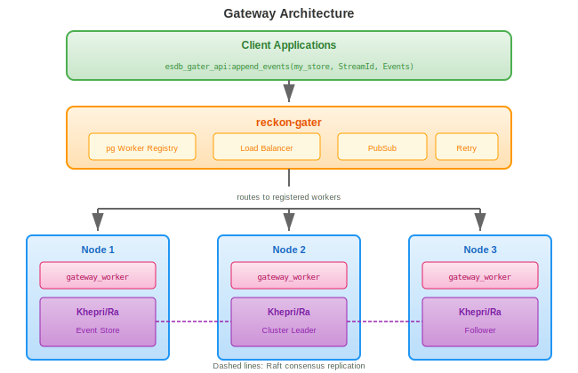

# reckon-db
[](https://buymeacoffee.com/beamologist)

BEAM-native Event Store built on Khepri/Ra with Raft consensus.


## Overview

reckon-db is an Erlang implementation of a distributed event store designed for:
- **Event Sourcing**: Store and replay events with optimistic concurrency
- **Clustering**: Automatic node discovery and Raft-based replication
- **High Throughput**: Partitioned writers for concurrent stream writes
- **Edge & Datacenter**: Works on Nerves devices and Kubernetes clusters

## Features

- Event stream operations (append, read, subscribe) with versioning and optimistic concurrency
- Persistent subscriptions (stream, event type, pattern, payload matching)
- Snapshot management for aggregate state
- Emitter pools for high-throughput event delivery
- UDP multicast and Kubernetes DNS discovery
- BEAM telemetry with optional OpenTelemetry exporters

## Installation

Add to your `rebar.config`:

```erlang
{deps, [
    {reckon_db, "1.0.0"}
]}.
```

Pure Erlang implementation - works everywhere, no native dependencies.

## Quick Start

```erlang
%% Start the application
application:ensure_all_started(reckon_db).

%% Append events to a stream
Events = [
    #{
        event_type => <<"user_created">>,
        data => #{name => <<"Alice">>, email => <<"alice@example.com">>},
        metadata => #{correlation_id => <<"req-123">>}
    }
],
{ok, Version} = reckon_db_streams:append(my_store, <<"user-123">>, -1, Events).

%% Read events from a stream
{ok, ReadEvents} = reckon_db_streams:read(my_store, <<"user-123">>, 0, 100, forward).

%% Subscribe to events
{ok, SubKey} = reckon_db_subscriptions:subscribe(
    my_store,
    stream,                    %% Type: stream | event_type | event_pattern | event_payload
    <<"user-123">>,            %% Selector
    <<"user_projection">>      %% Subscription name
).

%% Receive events
receive
    {event, Event} -> io:format("Received: ~p~n", [Event])
end.
```

## API Reference

### Streams

```erlang
%% Append events (returns new version)
reckon_db_streams:append(StoreId, StreamId, ExpectedVersion, Events) ->
    {ok, NewVersion} | {error, version_mismatch | term()}.

%% Read events from a stream
reckon_db_streams:read(StoreId, StreamId, FromVersion, Count, Direction) ->
    {ok, [Event]} | {error, stream_not_found | term()}.

%% Read across all streams
reckon_db_streams:read_all(StoreId, FromVersion, Count, Direction) ->
    {ok, [Event]} | {error, term()}.

%% Read events by type
reckon_db_streams:read_by_event_types(StoreId, EventTypes, Opts) ->
    {ok, [Event]} | {error, term()}.

%% Get stream version
reckon_db_streams:get_version(StoreId, StreamId) -> {ok, Version} | {error, term()}.

%% Check if stream exists
reckon_db_streams:exists(StoreId, StreamId) -> boolean().

%% List all streams
reckon_db_streams:list_streams(StoreId) -> {ok, [StreamId]} | {error, term()}.

%% Delete stream (soft delete)
reckon_db_streams:delete(StoreId, StreamId) -> ok | {error, term()}.
```

### Subscriptions

```erlang
%% Create subscription
reckon_db_subscriptions:subscribe(StoreId, Type, Selector, Name) ->
    {ok, SubscriptionKey} | {error, term()}.
reckon_db_subscriptions:subscribe(StoreId, Type, Selector, Name, Opts) ->
    {ok, SubscriptionKey} | {error, term()}.

%% Remove subscription (by key or by type+name)
reckon_db_subscriptions:unsubscribe(StoreId, SubscriptionKey) -> ok | {error, term()}.
reckon_db_subscriptions:unsubscribe(StoreId, Type, SubscriptionName) -> ok | {error, term()}.

%% Get subscription by key
reckon_db_subscriptions:get(StoreId, SubscriptionKey) ->
    {ok, Subscription} | {error, not_found}.

%% Acknowledge event processing
reckon_db_subscriptions:ack(StoreId, StreamId, SubscriptionName, EventNumber) -> ok.

%% List subscriptions
reckon_db_subscriptions:list(StoreId) -> {ok, [Subscription]}.

%% Check if subscription exists
reckon_db_subscriptions:exists(StoreId, SubscriptionKey) -> boolean().

%% Subscription types:
%%   stream - Events from a specific stream
%%   event_type - Events matching event type
%%   event_pattern - Events matching stream pattern (wildcards)
%%   event_payload - Events matching payload criteria
```

### Snapshots

```erlang
%% Save snapshot
reckon_db_snapshots:save(StoreId, StreamId, Version, Data) -> ok.
reckon_db_snapshots:save(StoreId, StreamId, Version, Data, Metadata) -> ok.

%% Load latest snapshot
reckon_db_snapshots:load(StoreId, StreamId) -> {ok, Snapshot} | {error, not_found}.

%% Load snapshot at specific version
reckon_db_snapshots:load_at(StoreId, StreamId, Version) -> {ok, Snapshot} | {error, not_found}.

%% List all snapshots for stream
reckon_db_snapshots:list(StoreId, StreamId) -> {ok, [Snapshot]}.

%% Delete all snapshots for stream
reckon_db_snapshots:delete(StoreId, StreamId) -> ok.

%% Delete snapshot at specific version
reckon_db_snapshots:delete_at(StoreId, StreamId, Version) -> ok.

%% Check if snapshot exists
reckon_db_snapshots:exists(StoreId, StreamId) -> boolean().
reckon_db_snapshots:exists_at(StoreId, StreamId, Version) -> boolean().
```

### Aggregation

```erlang
%% Fold events left to right (chronological order)
%% Returns a tagged_map with {sum, N} and {overwrite, V} tags preserved
reckon_db_aggregator:foldl(Events) -> tagged_map().
reckon_db_aggregator:foldl(Events, InitialState) -> tagged_map().

%% Fold events right to left (reverse order)
reckon_db_aggregator:foldr(Events) -> tagged_map().
reckon_db_aggregator:foldr(Events, InitialState) -> tagged_map().

%% Finalize a tagged map (unwrap {sum, N} -> N, {overwrite, V} -> V)
reckon_db_aggregator:finalize(TaggedMap) -> map().

%% Aggregate events with optional snapshot (convenience function)
reckon_db_aggregator:aggregate(Events, Snapshot | undefined, Opts) -> map().
%% Opts: #{initial_state => map(), finalize => boolean()}
```

Example usage:

```erlang
%% Load events and aggregate
{ok, Events} = reckon_db_streams:read(my_store, <<"account-123">>, 0, 10000, forward),
TaggedState = reckon_db_aggregator:foldl(Events, #{balance => {sum, 0}}),
FinalState = reckon_db_aggregator:finalize(TaggedState).

%% Or use aggregate/3 with snapshot support
{ok, Snapshot} = reckon_db_snapshots:load(my_store, <<"account-123">>),
{ok, NewEvents} = reckon_db_streams:read(my_store, <<"account-123">>, Snapshot#snapshot.version + 1, 10000, forward),
State = reckon_db_aggregator:aggregate(NewEvents, Snapshot, #{}).
```

### Telemetry

```erlang
%% Attach default logger handler
reckon_db_telemetry:attach_default_handler() -> ok.

%% Attach custom handler
reckon_db_telemetry:attach(HandlerId, HandlerFun, Config) -> ok.

%% Detach handler
reckon_db_telemetry:detach(HandlerId) -> ok.
```

## Configuration

```erlang
%% sys.config
[{reckon_db, [
    {stores, [
        {my_store, [
            {data_dir, "/var/lib/reckon_db/my_store"},
            {mode, cluster},  %% single | cluster
            {timeout, 5000}
        ]}
    ]},
    {telemetry_handlers, [logger]},
    {writer_pool_size, 10},
    {reader_pool_size, 10},

    %% Cluster discovery (cluster mode only)
    {discovery, [
        {method, multicast},  %% multicast | k8s_dns
        {port, 45892},
        {multicast_addr, {239, 255, 0, 1}},
        {secret, <<"cluster_secret">>}
    ]}
]}].
```

## Architecture

### Supervision Tree



### Event Flow



## Telemetry Events

| Event | Measurements | Metadata |
|-------|--------------|----------|
| `[reckon_db, stream, write, start]` | system_time | store_id, stream_id, event_count |
| `[reckon_db, stream, write, stop]` | duration, event_count | store_id, stream_id, new_version |
| `[reckon_db, stream, write, error]` | duration | store_id, stream_id, reason |
| `[reckon_db, stream, read, start]` | system_time | store_id, stream_id |
| `[reckon_db, stream, read, stop]` | duration, event_count | store_id, stream_id |
| `[reckon_db, subscription, created]` | system_time | store_id, subscription_id, type |
| `[reckon_db, subscription, deleted]` | system_time | store_id, subscription_id |
| `[reckon_db, snapshot, created]` | duration, size_bytes | store_id, stream_id, version |
| `[reckon_db, cluster, node, up]` | system_time | store_id, node, member_count |
| `[reckon_db, cluster, node, down]` | system_time | store_id, node, reason |
| `[reckon_db, cluster, leader, elected]` | system_time | store_id, leader |

## Building

```bash
rebar3 compile         # Compile
rebar3 eunit           # Unit tests
rebar3 ct              # Integration tests
rebar3 dialyzer        # Type checking
rebar3 cover           # Coverage report
```

## Testing

Test counts:
- **Unit tests**: 446 tests (including NIF modules with enterprise/community equivalence tests)
- **Integration tests**: 53 tests (streams, subscriptions, snapshots, cluster)
- **End-to-end tests**: 24 tests (full gater integration)

```bash
rebar3 eunit --dir=test/unit              # All unit tests
rebar3 ct --dir=test/integration          # Integration tests
rebar3 ct --dir=test/e2e                  # E2E tests with gater
rebar3 ct --suite=reckon_db_streams_SUITE  # Streams tests
rebar3 ct --suite=reckon_db_cluster_SUITE  # Cluster tests
```

## Gateway API

reckon-db is accessed through [reckon-gater](https://github.com/reckon-db-org/reckon-gater), which provides the unified API for load-balanced, distributed access to event stores.

### How It Works

1. **reckon-db** starts and creates a gateway worker for each store
2. Gateway workers register with the **reckon-gater** pg-based registry
3. Clients use the gater API for all event store operations
4. The gater routes requests to registered workers using round-robin with failover

### Architecture



### Using the Gateway API

All event store operations go through the gater API:

```erlang
%% Stream operations
{ok, Version} = esdb_gater_api:append_events(my_store, StreamId, Events).
{ok, Events} = esdb_gater_api:stream_forward(my_store, StreamId, 0, 100).
{ok, Version} = esdb_gater_api:get_version(my_store, StreamId).

%% Subscription operations
ok = esdb_gater_api:save_subscription(my_store, stream, StreamId, Name, 0, self()).

%% Snapshot operations
ok = esdb_gater_api:record_snapshot(my_store, SourceUuid, StreamUuid, Version, Record).
{ok, Snap} = esdb_gater_api:read_snapshot(my_store, SourceUuid, StreamUuid, Version).
```

See [reckon-gater](https://hex.pm/packages/reckon_gater) for complete API documentation.

## Related Projects

- [reckon-gater](https://github.com/reckon-db-org/reckon-gater) - Gateway for distributed access
- [ex-esdb](https://github.com/beam-campus/ex-esdb) - Original Elixir implementation

## License

Apache-2.0
