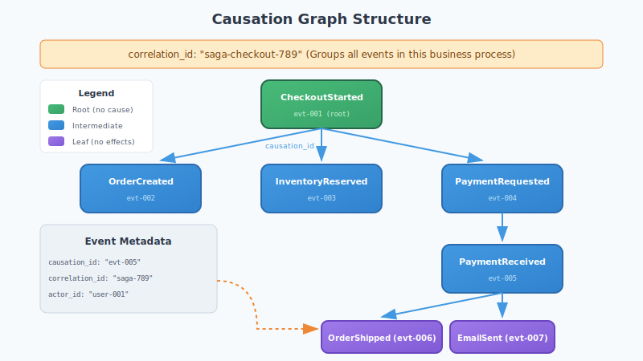
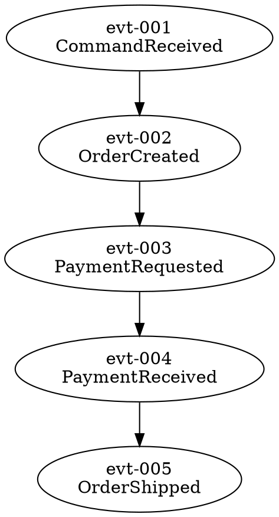

# Causation and Correlation Tracking

Causation tracking enables tracing event lineage through distributed systems. This guide covers how to track, query, and visualize event relationships.

## Overview

The `reckon_db_causation` module provides:

| Function | Purpose |
|----------|---------|
| `get_effects/2` | Find events caused by an event |
| `get_cause/2` | Find the event that caused this one |
| `get_chain/2` | Trace causation chain to root |
| `get_correlated/2` | Find all events in a saga |
| `build_graph/2` | Build visualization graph |
| `to_dot/1` | Export as Graphviz DOT |

## Architecture



## Metadata Convention

Events track lineage through standard metadata fields:

```erlang
#event{
    event_id = <<"evt-456">>,
    event_type = <<"OrderShipped">>,
    data = #{...},
    metadata = #{
        causation_id => <<"evt-123">>,     %% Direct cause
        correlation_id => <<"saga-789">>,  %% Business process
        actor_id => <<"user-001">>         %% Who triggered this
    }
}
```

### Field Definitions

| Field | Type | Purpose |
|-------|------|---------|
| `causation_id` | binary | Event ID that directly caused this event |
| `correlation_id` | binary | Groups events in a saga/process |
| `actor_id` | binary | Identity that triggered the event |

## Causation Queries

### Finding Effects

Get all events caused by a specific event:

```erlang
{ok, Effects} = reckon_db_causation:get_effects(my_store, <<"evt-123">>),
%% Returns all events where metadata.causation_id = "evt-123"
```

### Finding Cause

Get the event that caused this one:

```erlang
{ok, CauseEvent} = reckon_db_causation:get_cause(my_store, <<"evt-456">>),
%% Looks up event with ID matching this event's causation_id
```

### Tracing the Chain

Walk backward from an event to its root cause:

```erlang
{ok, Chain} = reckon_db_causation:get_chain(my_store, <<"evt-789">>),
%% Returns [RootEvent, ..., IntermediateEvents, ..., TargetEvent]
%% Ordered from root to target
```

### Finding Correlated Events

Get all events in a saga or business process:

```erlang
{ok, SagaEvents} = reckon_db_causation:get_correlated(my_store, <<"saga-001">>),
%% Returns all events where metadata.correlation_id = "saga-001"
%% Sorted by epoch_us (temporal order)
```

## Graph Building

### Build Causation Graph

```erlang
%% Build from a specific event
{ok, Graph} = reckon_db_causation:build_graph(my_store, <<"evt-123">>),

%% Or build from a correlation ID
{ok, Graph} = reckon_db_causation:build_graph(my_store, <<"saga-001">>),

%% Graph structure:
%% #{
%%     nodes => [Event1, Event2, ...],
%%     edges => [{CauseId, EffectId}, ...],
%%     root => RootEventId | undefined
%% }
```

### Export to Graphviz

Generate DOT format for visualization:

```erlang
{ok, Graph} = reckon_db_causation:build_graph(my_store, <<"saga-001">>),
DotBinary = reckon_db_causation:to_dot(Graph),

%% Write to file
file:write_file("causation.dot", DotBinary),

%% Render with graphviz:
%% dot -Tpng -o causation.png causation.dot
%% dot -Tsvg -o causation.svg causation.dot
```

## How It Works

### Storage (No Index)

Currently, causation queries scan all streams:

```erlang
scan_for_metadata(StoreId, Field, Value) ->
    {ok, StreamIds} = reckon_db_streams:list_streams(StoreId),
    Events = lists:foldl(
        fun(StreamId, Acc) ->
            MatchingEvents = scan_stream_for_metadata(StoreId, StreamId, Field, Value),
            Acc ++ MatchingEvents
        end,
        [],
        StreamIds
    ),
    {ok, lists:sort(fun(A, B) -> A#event.epoch_us =< B#event.epoch_us end, Events)}.
```

**Performance Note**: This is O(n) where n = total events across all streams. For production systems with many events, consider adding secondary indexes.

### Chain Building

Chains are built by walking backward through causation links:

```erlang
build_chain_backward(StoreId, Event, Acc) ->
    case maps:get(causation_id, Event#event.metadata, undefined) of
        undefined ->
            Acc;  %% Reached root
        CausationId ->
            case find_event_by_id(StoreId, CausationId) of
                {ok, CauseEvent} ->
                    build_chain_backward(StoreId, CauseEvent, [CauseEvent | Acc]);
                {error, _} ->
                    Acc  %% Chain broken (event deleted?)
            end
    end.
```

## Use Cases

### 1. Debugging Distributed Flows

```erlang
%% An order failed - trace back to root cause
{ok, Chain} = reckon_db_causation:get_chain(my_store, <<"order-failed-evt">>),
lists:foreach(
    fun(Event) ->
        io:format("~s: ~s (~s)~n", [
            Event#event.epoch_us,
            Event#event.event_type,
            Event#event.stream_id
        ])
    end,
    Chain
).
```

### 2. Saga Visualization

```erlang
%% Visualize a checkout saga
{ok, Graph} = reckon_db_causation:build_graph(my_store, <<"checkout-saga-123">>),
Dot = reckon_db_causation:to_dot(Graph),
file:write_file("/tmp/checkout.dot", Dot),
os:cmd("dot -Tsvg -o /tmp/checkout.svg /tmp/checkout.dot").
```

### 3. Audit Trail

```erlang
%% Who/what triggered this sensitive operation?
{ok, Event} = find_event(my_store, <<"sensitive-action-evt">>),
{ok, Chain} = reckon_db_causation:get_chain(my_store, Event#event.event_id),
RootEvent = hd(Chain),
ActorId = maps:get(actor_id, RootEvent#event.metadata, <<"unknown">>),
io:format("Sensitive action originated from actor: ~s~n", [ActorId]).
```

### 4. Impact Analysis

```erlang
%% What happened because of this event?
{ok, Effects} = reckon_db_causation:get_effects(my_store, <<"payment-received-evt">>),
io:format("Payment triggered ~p downstream events~n", [length(Effects)]).
```

## Setting Causation IDs

When appending events, include causation metadata:

```erlang
%% In a command handler
handle_command(Command, State, CausationContext) ->
    Event = #{
        event_type => <<"OrderPlaced">>,
        data => #{order_id => Command#cmd.order_id, items => Command#cmd.items},
        metadata => #{
            causation_id => CausationContext#ctx.event_id,
            correlation_id => CausationContext#ctx.correlation_id,
            actor_id => CausationContext#ctx.user_id
        }
    },
    {ok, _} = reckon_db_streams:append(Store, Stream, ExpectedVersion, [Event]).
```

## Telemetry

Causation queries emit telemetry:

```erlang
%% Event: [reckon_db, causation, query]
%% Measurements:
%%   #{duration => integer(), event_count => integer()}
%% Metadata:
%%   #{store_id => atom(), id => binary(), query_type => atom()}

%% Query types: causation_effects, causation_cause, causation_chain, causation_correlated
```

## DOT Format Example

Generated DOT output:



Rendered as:

```
CommandReceived → OrderCreated → PaymentRequested → PaymentReceived → OrderShipped
```

## Error Handling

| Error | Cause | Resolution |
|-------|-------|------------|
| `{error, not_found}` | Event ID does not exist | Verify event ID |
| `{error, no_cause}` | Event has no causation_id | This is a root event |

## Best Practices

### 1. Always Set Correlation ID

```erlang
%% Generate at saga/process start, propagate through all events
CorrelationId = uuid:uuid_to_string(uuid:get_v4()),
%% Use this same ID for all events in the business process
```

### 2. Preserve Causation Context

```erlang
%% When handling an event that triggers new events
handle_event(SourceEvent, State) ->
    NewEventMetadata = #{
        causation_id => SourceEvent#event.event_id,
        correlation_id => maps:get(correlation_id, SourceEvent#event.metadata)
    },
    ...
```

### 3. Include Actor ID at Entry Points

```erlang
%% At API/command entry points
Metadata = #{
    correlation_id => new_correlation_id(),
    actor_id => RequestContext#ctx.authenticated_user
}.
```

## Future Enhancements

Potential improvements for production scale:

1. **Secondary Index**: Add Khepri index on `causation_id` and `correlation_id`
2. **Materialized Graph**: Pre-compute causation graph per correlation
3. **Streaming Query**: Process events in batches to reduce memory
4. **Time-Bounded Search**: Limit search to recent time window

## See Also

- [Stream Links](stream_links.md) - Derived streams from causation patterns
- [Temporal Queries](temporal_queries.md) - Time-based event retrieval
- [Storage Internals](storage_internals.md) - Khepri path structure
