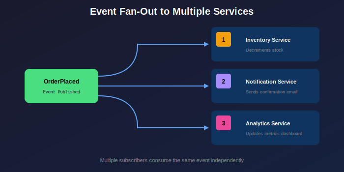

# Event Sourcing with reckon-db

Event Sourcing is an architectural pattern where the state of an application is determined by a sequence of events. Instead of storing just the current state, you store the complete history of state changes as immutable events.


## What is Event Sourcing?

Traditional CRUD-based systems store only the current state:

```
User Record: {id: 123, name: "Alice", email: "alice@example.com", balance: 150}
```

Event-sourced systems store the history of changes:

```
Event 1: UserCreated {id: 123, name: "Alice", email: "alice@example.com"}
Event 2: BalanceDeposited {user_id: 123, amount: 200}
Event 3: BalanceWithdrawn {user_id: 123, amount: 50}
```

The current state is derived by replaying these events.

## Benefits of Event Sourcing

### Complete Audit Trail
Every change is recorded with a timestamp and metadata. This is invaluable for:
- Regulatory compliance (financial systems, healthcare)
- Debugging production issues
- Understanding user behavior

### Temporal Queries
You can reconstruct the state at any point in time:

```erlang
%% Get account balance as of last month
{ok, Events} = reckon_db_streams:read(my_store, <<"account-123">>, 0, 1000, forward),
PastEvents = [E || E <- Events, E#event.timestamp < LastMonthTimestamp],
Balance = lists:foldl(fun apply_event/2, 0, PastEvents).
```

### Event Replay
Rebuild read models, fix bugs in projections, or create new views of historical data:

```erlang
%% Rebuild a projection from scratch
{ok, Events} = reckon_db_streams:read(my_store, <<"orders-*">>, 0, infinity, forward),
lists:foreach(fun(E) -> update_projection(E) end, Events).
```

### Decoupled Systems
Events can be consumed by multiple subscribers independently:



## Event Sourcing with reckon-db

### Streams

A **stream** is an ordered sequence of events sharing a common identifier (the stream ID). Streams typically represent:
- An aggregate (e.g., `order-123`, `user-456`)
- A category (e.g., `orders`, `users`)
- A partition (e.g., `orders-region-eu`)

```erlang
%% Append events to a stream
Events = [
    #{
        event_type => <<"OrderPlaced">>,
        data => #{order_id => <<"ord-123">>, items => [...], total => 9999},
        metadata => #{user_id => <<"user-456">>, correlation_id => <<"req-789">>}
    }
],
{ok, Version} = reckon_db_streams:append(my_store, <<"order-ord-123">>, -1, Events).
```

### Events

Events are immutable facts that have happened. They should:
- Be named in past tense (e.g., `OrderPlaced`, not `PlaceOrder`)
- Contain all information needed to understand what happened
- Be business-meaningful (e.g., `AccountOverdrawn`, not `BalanceUpdated`)

```erlang
%% Event structure
#{
    event_type => <<"OrderPlaced">>,      %% What happened
    data => #{                             %% The event payload
        order_id => <<"ord-123">>,
        customer_id => <<"cust-456">>,
        items => [
            #{product_id => <<"prod-1">>, quantity => 2, price => 1999}
        ],
        total => 3998
    },
    metadata => #{                         %% Cross-cutting concerns
        correlation_id => <<"req-abc">>,   %% Traces related operations
        causation_id => <<"evt-xyz">>,     %% What caused this event
        user_id => <<"user-789">>,         %% Who triggered it
        timestamp => 1703001234567         %% When it happened
    }
}
```

### Optimistic Concurrency

reckon-db uses optimistic concurrency control to prevent conflicting writes:

```erlang
%% Expected version semantics:
%% -1 (NO_STREAM): Stream must not exist (first write)
%% -2 (ANY_VERSION): No version check, always append
%% N >= 0: Stream version must equal N

%% First write to a new stream
{ok, 0} = reckon_db_streams:append(Store, <<"order-123">>, -1, [Event1]).

%% Subsequent writes must specify expected version
{ok, 1} = reckon_db_streams:append(Store, <<"order-123">>, 0, [Event2]).

%% Concurrent writes will fail with version mismatch
%% Process A reads version 1
%% Process B reads version 1
%% Process A writes with expected version 1 -> succeeds, version is now 2
%% Process B writes with expected version 1 -> fails! (wrong_expected_version)
```

## Designing Events

### Event Naming

Use past tense verbs that describe business facts:

| Good | Bad |
|------|-----|
| `OrderPlaced` | `CreateOrder` |
| `PaymentReceived` | `ProcessPayment` |
| `ItemShipped` | `ShipItem` |
| `AccountOverdrawn` | `UpdateBalance` |

### Event Granularity

Events should be atomic business facts. Avoid:
- Generic events like `EntityUpdated` (not meaningful)
- Overly fine-grained events (one per field change)
- Composite events (multiple unrelated changes)

```erlang
%% Good: Specific, meaningful events
#{event_type => <<"AddressChanged">>, data => #{
    old_address => OldAddr,
    new_address => NewAddr,
    reason => <<"customer_request">>
}}

%% Bad: Generic, meaningless event
#{event_type => <<"CustomerUpdated">>, data => #{
    field => <<"address">>,
    value => NewAddr
}}
```

### Event Versioning

Events are immutable, but schemas evolve. Use explicit versions:

```erlang
%% Version 1
#{event_type => <<"OrderPlaced.v1">>, data => #{
    order_id => ...,
    items => [...]
}}

%% Version 2 (added shipping_address)
#{event_type => <<"OrderPlaced.v2">>, data => #{
    order_id => ...,
    items => [...],
    shipping_address => #{}
}}
```

Handle schema evolution in your projections:

```erlang
handle_event(#{event_type := <<"OrderPlaced.v1">>} = Event) ->
    %% Default shipping address for v1 events
    upgrade_to_v2(Event);
handle_event(#{event_type := <<"OrderPlaced.v2">>} = Event) ->
    process_order(Event).
```

## Building Aggregates

An **aggregate** is a domain object that encapsulates state and enforces invariants. In event sourcing, aggregates:
1. Load their state by replaying events
2. Validate commands against current state
3. Emit new events if the command succeeds

```erlang
-module(order_aggregate).
-export([new/0, apply_event/2, place_order/2, add_item/3]).

-record(order, {
    id,
    status = pending,
    items = [],
    total = 0
}).

%% Create a new aggregate
new() -> #order{}.

%% Apply events to rebuild state
apply_event(#{event_type := <<"OrderPlaced">>} = E, _Order) ->
    Data = maps:get(data, E),
    #order{
        id = maps:get(order_id, Data),
        status = placed,
        items = maps:get(items, Data),
        total = maps:get(total, Data)
    };

apply_event(#{event_type := <<"ItemAdded">>} = E, Order) ->
    Data = maps:get(data, E),
    NewItem = #{
        product_id => maps:get(product_id, Data),
        quantity => maps:get(quantity, Data),
        price => maps:get(price, Data)
    },
    Order#order{
        items = [NewItem | Order#order.items],
        total = Order#order.total + (maps:get(quantity, Data) * maps:get(price, Data))
    };

apply_event(#{event_type := <<"OrderShipped">>}, Order) ->
    Order#order{status = shipped}.

%% Commands that produce events
place_order(OrderId, Items) ->
    Total = lists:sum([Q * P || #{quantity := Q, price := P} <- Items]),
    {ok, [#{
        event_type => <<"OrderPlaced">>,
        data => #{order_id => OrderId, items => Items, total => Total}
    }]}.

add_item(#order{status = placed} = _Order, ProductId, Quantity) ->
    Price = get_product_price(ProductId),
    {ok, [#{
        event_type => <<"ItemAdded">>,
        data => #{product_id => ProductId, quantity => Quantity, price => Price}
    }]};
add_item(#order{status = shipped}, _ProductId, _Quantity) ->
    {error, order_already_shipped}.
```

### Loading Aggregate State

Use `reckon_db_aggregator` to rebuild aggregate state:

```erlang
%% Load order aggregate from event stream
load_order(StoreId, OrderId) ->
    StreamId = <<"order-", OrderId/binary>>,

    %% Read events from stream
    {ok, Events} = reckon_db_streams:read(StoreId, StreamId, 0, 10000, forward),

    %% Apply events to initial state using custom apply function
    InitialState = order_aggregate:new(),
    FinalState = lists:foldl(
        fun(Event, Acc) -> order_aggregate:apply_event(Event, Acc) end,
        InitialState,
        Events
    ),
    FinalState.

%% Or use reckon_db_aggregator for tagged value aggregation
%% (useful when events have {sum, N} or {overwrite, V} tagged values)
load_order_with_aggregator(StoreId, OrderId) ->
    StreamId = <<"order-", OrderId/binary>>,
    {ok, Events} = reckon_db_streams:read(StoreId, StreamId, 0, 10000, forward),
    TaggedState = reckon_db_aggregator:foldl(Events),
    reckon_db_aggregator:finalize(TaggedState).
```

## Further Reading

- [CQRS Guide](cqrs.md) - Command Query Responsibility Segregation
- [Subscriptions Guide](subscriptions.md) - Real-time event notifications
- [Snapshots Guide](snapshots.md) - Optimizing aggregate loading

## References

- Martin Fowler: [Event Sourcing](https://martinfowler.com/eaaDev/EventSourcing.html)
- Greg Young: [CQRS and Event Sourcing](https://cqrs.files.wordpress.com/2010/11/cqrs_documents.pdf)
- Vaughn Vernon: "Implementing Domain-Driven Design" (Chapters 8-10)
