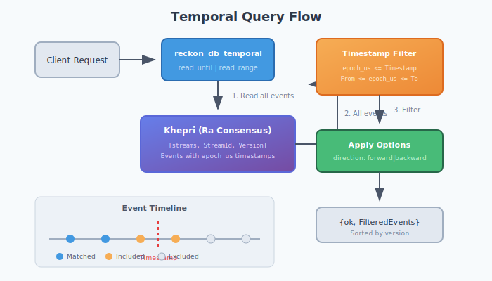

# Temporal Queries

Temporal queries enable point-in-time reconstruction of aggregate state and time-range analytics. This guide covers the server-side implementation, storage mechanics, and cluster behavior.

## Overview

The `reckon_db_temporal` module provides three core operations:

| Function | Purpose |
|----------|---------|
| `read_until/3,4` | Read events up to a timestamp |
| `read_range/4,5` | Read events within a time range |
| `version_at/3` | Get stream version at a timestamp |

## Architecture



## How Temporal Filtering Works

### Timestamp Storage

Every event stored in reckon-db includes an `epoch_us` field - microseconds since Unix epoch:

```erlang
#event{
    event_id = <<"evt-123">>,
    stream_id = <<"orders-456">>,
    version = 5,
    epoch_us = 1735689600000000,  %% Jan 1, 2025 00:00:00 UTC
    event_type = <<"OrderPlaced">>,
    data = #{...},
    metadata = #{...}
}
```

This timestamp is set at append time using `erlang:system_time(microsecond)`.

### Query Execution

Temporal queries follow this execution path:

1. **Stream Existence Check**: Verify stream exists in Khepri
2. **Event Retrieval**: Read all events from the stream
3. **Timestamp Filtering**: Filter events by `epoch_us` field
4. **Options Application**: Apply direction and limit options

```erlang
%% Internal filtering for read_until
filter_events_until(Events, Timestamp) ->
    [E || E <- Events, E#event.epoch_us =< Timestamp].

%% Internal filtering for read_range
filter_events_range(Events, FromTimestamp, ToTimestamp) ->
    [E || E <- Events,
          E#event.epoch_us >= FromTimestamp,
          E#event.epoch_us =< ToTimestamp].
```

## Khepri Storage Path

Events are stored at:

```
[streams, StreamId, PaddedVersion] -> #event{}
```

The 12-character zero-padded version enables lexicographic ordering:

```
[streams, <<"orders-123">>, <<"000000000000">>] -> Event v0
[streams, <<"orders-123">>, <<"000000000001">>] -> Event v1
[streams, <<"orders-123">>, <<"000000000002">>] -> Event v2
```

## Cluster Behavior

### Consistency Guarantees

Temporal queries inherit Khepri/Ra's consistency model:

| Aspect | Behavior |
|--------|----------|
| **Read Consistency** | Strongly consistent (reads go through Raft leader) |
| **Cross-Node** | Same results on any cluster node |
| **Partition Tolerance** | Queries fail if no quorum available |

### Leader Routing

All reads are routed to the Ra leader:

```
Client Request
     │
     ▼
┌─────────────┐
│ Any Node    │
│ (Follower)  │
└──────┬──────┘
       │ Forward to leader
       ▼
┌─────────────┐
│ Ra Leader   │
│ (Reads)     │
└──────┬──────┘
       │ Raft log consistency
       ▼
  Query Result
```

## Performance Considerations

### Current Implementation

The current implementation reads all events, then filters in memory:

```erlang
read_all_events(StoreId, StreamId) ->
    Version = reckon_db_streams:get_version(StoreId, StreamId),
    case Version of
        ?NO_STREAM -> {ok, []};
        _ -> reckon_db_streams:read(StoreId, StreamId, 0, Version + 1, forward)
    end.
```

**Implications:**
- O(n) memory usage where n = total events in stream
- Suitable for streams with < 10,000 events
- For larger streams, consider snapshots + temporal queries

### Optimization Opportunities

Future versions could add:

1. **Khepri Timestamp Index**: Secondary index on `epoch_us`
2. **Binary Search**: If events are sorted by timestamp (they are by version, usually correlated)
3. **Streaming API**: Process events in batches to reduce memory

## Use Cases

### 1. Point-in-Time State Reconstruction

```erlang
%% Reconstruct order state as it was on Dec 31, 2024
Timestamp = 1735603200000000,  %% Dec 31, 2024 00:00:00 UTC
{ok, Events} = reckon_db_temporal:read_until(my_store, <<"order-123">>, Timestamp),
State = lists:foldl(fun apply_event/2, initial_state(), Events).
```

### 2. Audit Queries

```erlang
%% What was the account balance at end of fiscal year?
FiscalYearEnd = 1735689599999999,  %% Dec 31, 2024 23:59:59.999999 UTC
{ok, Events} = reckon_db_temporal:read_until(my_store, <<"account-456">>, FiscalYearEnd),
Balance = calculate_balance(Events).
```

### 3. Time-Range Analytics

```erlang
%% Analyze orders from Q4 2024
Q4Start = 1727740800000000,  %% Oct 1, 2024
Q4End = 1735689599999999,    %% Dec 31, 2024
{ok, Events} = reckon_db_temporal:read_range(my_store, <<"orders-*">>, Q4Start, Q4End),
analyze_quarterly_orders(Events).
```

### 4. Version Discovery

```erlang
%% What version should I replay to for a snapshot at timestamp T?
{ok, Version} = reckon_db_temporal:version_at(my_store, <<"user-789">>, Timestamp),
%% Now load snapshot at Version, or replay events 0..Version
```

## Options

Both `read_until/4` and `read_range/5` accept options:

```erlang
-type opts() :: #{
    direction => forward | backward,  %% Event order (default: forward)
    limit => pos_integer()             %% Max events to return
}.
```

**Direction**: Controls the order of returned events
- `forward`: Oldest first (ascending by version)
- `backward`: Newest first (descending by version)

**Limit**: Truncates result after applying direction

## Telemetry

Temporal queries emit telemetry events:

```erlang
%% Event: [reckon_db, temporal, read_until]
%% Measurements: #{duration => integer(), event_count => integer()}
%% Metadata: #{store_id => atom(), stream_id => binary(), timestamp => integer()}

%% Event: [reckon_db, temporal, read_range]
%% Measurements: #{duration => integer(), event_count => integer()}
%% Metadata: #{store_id => atom(), stream_id => binary(), timestamp => {From, To}}
```

## Error Handling

| Error | Cause | Resolution |
|-------|-------|------------|
| `{error, {stream_not_found, StreamId}}` | Stream does not exist | Verify stream ID |
| `{error, timeout}` | Khepri/Ra timeout | Check cluster health |
| `{error, no_quorum}` | Ra cluster partitioned | Wait for partition heal |

## Best Practices

1. **Use Snapshots**: For frequently queried historical points, save snapshots
2. **Limit Result Size**: Use the `limit` option for large time ranges
3. **Monitor Duration**: Track telemetry for slow queries
4. **Consider Stream Size**: Temporal queries load full streams; partition large streams

## See Also

- [Snapshots](snapshots.md) - State caching for performance
- [Scavenging](scavenging.md) - Event lifecycle management
- [Storage Internals](storage_internals.md) - Khepri path structure
